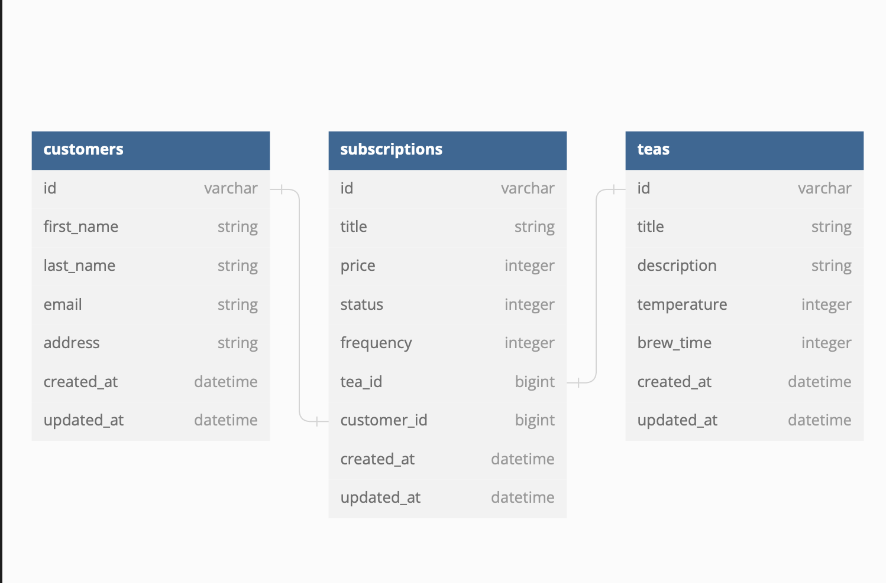

<div align="center">

## Tea Subscription

[![ruby][ruby]][ruby-url] [![ror][ror]][ror-url] [![Postgres][Postgres]][Postgres-url] [![RSpec][RSpec]][RSpec-url] [![Atom][Atom]][Atom-url]

#### Contributors: [Lucas Colwell](https://github.com/lcole37)

</div>

---

## Description

A rails backend API; Tea Subscription was built with test-driven development, with Rspec used for testing. It is built with Rails conventions over configuration as a guiding principle. A service-facade design pattern is used when calling external API services.

---

# <a name="contents"></a> Table of contents

- [Architecture](#architecture)
- [Database setup](#database-setup)
  - [Required API keys](#required-keys)
- [Endpoints](#endpoints)
  - [Create Subscription](#create-sub)
  - [Cancel Subscription](#cancel-sub)
  - [Fetch Customer Subscriptions](#customer-subs)

---

# <a name="architecture"></a>Architecture

# 

---
<p align="right">(<a href="#contents">back to top</a>)</p>

# <a name="database-setup"></a>Database Setup

Instructions to set up a local copy of Tea Subscription:

Fork and clone the project, then install the required gems with `bundle`. A full list of gems that will be installed can be found in the [gemfile][gemfile-url].

```sh
bundle install
```

Reset and seed the database:

```sh
rake db:{drop,create,migrate,seed}
```

Start a rails server, and you're ready to query

```sh
rails s
```

---
<p align="right">(<a href="#contents">back to top</a>)</p>

# <a name="endpoints"></a>Endpoints

## <a name="create-sub"></a>Create Subscription

Creates a new customer subscription.

<br>

```
POST '/api/v1/subscriptions'
```

**Sample body**

 ```
 {
  "title": “Mark G’s Herbal",
  "price": 15,
  "frequency": "monthly",
  "customer_id": {{customer_id}},
  "tea_id": {{tea_id}}
 }
 ```

**Sample response (status 200)**

 ```
 {
     "data": {
         "id": "4",
         "type": "subscription",
         "attributes": {
             "title": “Mark G’s Herbal",
             "status": "active",
             "price": 15,
             "frequency": "monthly",
             "tea_id": 1,
             "customer_id": 1
         }
     }
 }
 ```

**Sample body**

 ```
 {
   "title": "",
   "price": 15,
   "frequency": "monthly",
   "customer_id": {{customer_id}},
   "tea_id": {{tea_id}}
 }
 ```

**Sample response (status 422)**

 ```
[
  "Title can't be blank"
]
 ```

---
<p align="right">(<a href="#contents">back to top</a>)</p>

## <a name="cancel-sub"></a>Cancel Subscription

Cancel a customer subscription.

<br>

```
PATCH "/api/v1/subscriptions/#{id}"
```

<br>

**Sample body**

 ```
 {
     "status": 1
 }
 ```

**Sample response (status 200)**

 ```
 {
     "data": {
         "id": "1",
         "type": "subscription",
         "attributes": {
             "title": “Mark G’s Oolong",
             "status": "cancelled",
             "price": 11,
             "frequency": "monthly",
             "tea_id": 1,
             "customer_id": 1
         }
     }
 }
 ```

**Sample body**

 ```
 {
     "status": 2
 }
 ```


---
<p align="right">(<a href="#contents">back to top</a>)</p>

## <a name="customer-subs"></a>Customer Subscriptions

Fetch all subscriptions belonging to a customer.

<br>

```
GET "/api/v1/customers/#{customer_id}/subscriptions"
```

**Sample response (status 200)**

 ```
 {
     "data": [
         {
             "id": "1",
             "type": "subscription",
             "attributes": {
                 "title": “Mark G’s Rooibos”,
                 "status": "active",
                 "price": 7,
                 "frequency": "quarterly",
                 "tea_id": 1,
                 "customer_id": 1
             }
         },
         {
             "id": "2",
             "type": "subscription",
             "attributes": {
                 "title": “Pat H’s Green",
                 "status": "active",
                 "price": 14,
                 "frequency": "one_time",
                 "tea_id": 2,
                 "customer_id": 1
             }
         },
         {
             "id": "3",
             "type": "subscription",
             "attributes": {
                 "title": “Rose T’s Black Ceylon”,
                 "status": "active",
                 "price": 10,
                 "frequency": "weekly",
                 "tea_id": 3,
                 "customer_id": 1
             }
         }
     ]
 }
 ```


---
<p align="right">(<a href="#contents">back to top</a>)</p>

<!-- MARKDOWN LINKS & IMAGES -->
<!-- https://www.markdownguide.org/basic-syntax/#reference-style-links -->

[contributors-shield]: https://img.shields.io/github/contributors/lcole37/tea_subscription.svg?style=for-the-badge
[contributors-url]: https://github.com/lcole37/tea_subscription/graphs/contributors
[forks-shield]: https://img.shields.io/github/forks/lcole37/tea_subscription.svg?style=for-the-badge
[forks-url]: https://github.com/lcole37/tea_subscription/network/members
[gemfile-url]: https://github.com/lcole37/tea_subscription/blob/main/Gemfile
[stars-shield]: https://img.shields.io/github/stars/lcole37/tea_subscription.svg?style=for-the-badge
[stars-url]: https://github.com/lcole37/tea_subscription/stargazers
[issues-shield]: https://img.shields.io/github/issues/AMSterling/tea_subscription.svg?style=for-the-badge
[issues-url]: https://github.com/lcole37/tea_subscription/issues
[license-shield]: https://img.shields.io/github/license/AMSterling/tea_subscription.svg?style=for-the-badge
[license-url]: https://github.com/lcole37/tea_subscription/blob/master/LICENSE.txt
[linkedin-shield]: https://img.shields.io/badge/-LinkedIn-black.svg?style=for-the-badge&logo=linkedin&colorB=555
[linkedin-url]: https://linkedin.com/in/lucas-colwell-b3a753179/

[Atom]: https://img.shields.io/badge/Atom-66595C?style=for-the-badge&logo=Atom&logoColor=white
[Atom-url]: https://github.com/atom/atom/releases/tag/v1.60.0

[Bootstrap]: https://img.shields.io/badge/bootstrap-%23563D7C.svg?style=for-the-badge&logo=bootstrap&logoColor=white
[Bootstrap-url]: https://getbootstrap.com/

[Capybara]: https://custom-icon-badges.demolab.com/badge/Capybara-F7F4EF?style=for-the-badge&logo=capybara
[Capybara-url]: https://www.patreon.com/capybara

[CircleCI]: https://img.shields.io/badge/circle%20ci-%23161616.svg?style=for-the-badge&logo=circleci&logoColor=white
[CircleCI-url]: https://circleci.com/developer

[CSS]: https://img.shields.io/badge/CSS-239120?&style=for-the-badge&logo=css3&logoColor=white
[CSS-url]: https://en.wikipedia.org/wiki/CSS

[Fly]: https://custom-icon-badges.demolab.com/badge/Fly-DCDCDC?style=for-the-badge&logo=fly-io
[Fly-url]: https://fly.io/

[Git Badge]: https://img.shields.io/badge/GIT-E44C30?style=for-the-badge&logo=git&logoColor=white
[Git-url]: https://git-scm.com/

[GitHub Badge]: https://img.shields.io/badge/GitHub-100000?style=for-the-badge&logo=github&logoColor=white
[GitHub-url]: https://github.com/lcole37/

[GitHub Actions]: https://img.shields.io/badge/github%20actions-%232671E5.svg?style=for-the-badge&logo=githubactions&logoColor=white
[GitHub Actions-url]: https://github.com/features/actions

[GraphQL]: https://img.shields.io/badge/-GraphQL-E10098?style=for-the-badge&logo=graphql&logoColor=white
[GraphQL-url]: https://graphql.org/

[Heroku]: https://img.shields.io/badge/Heroku-430098?style=for-the-badge&logo=heroku&logoColor=white
[Heroku-url]: https://www.heroku.com/

[Homebrew]: https://custom-icon-badges.demolab.com/badge/Homebrew-2e2a24?style=for-the-badge&logo=homebrew_logo
[Homebrew-url]: https://brew.sh/

[HTML5]: https://img.shields.io/badge/html5-%23E34F26.svg?style=for-the-badge&logo=html5&logoColor=white
[HTML5-url]: https://en.wikipedia.org/wiki/HTML5

[JavaScript]: https://img.shields.io/badge/javascript-%23323330.svg?style=for-the-badge&logo=javascript&logoColor=%23F7DF1E
[JavaScript-url]: https://www.javascript.com/

[jQuery]: https://img.shields.io/badge/jquery-%230769AD.svg?style=for-the-badge&logo=jquery&logoColor=white
[jQuery-url]: https://github.com/rails/jquery-rails

[LinkedIn Badge]: https://img.shields.io/badge/LinkedIn-0077B5?style=for-the-badge&logo=linkedin&logoColor=white
[LinkedIn-url]: https://www.linkedin.com/in/<Username>/

[MacOS]: https://img.shields.io/badge/mac%20os-000000?style=for-the-badge&logo=macos&logoColor=F0F0F0
[MacOS-url]: https://www.apple.com/macos


[Postgres]: https://img.shields.io/badge/postgres-%23316192.svg?style=for-the-badge&logo=postgresql&logoColor=white
[Postgres-url]: https://www.postgresql.org/

[PostgreSQL]: https://img.shields.io/badge/PostgreSQL-316192?style=for-the-badge&logo=postgresql&logoColor=white
[PostgreSQL-url]: https://www.postgresql.org/

[Postman]: https://img.shields.io/badge/Postman-FF6C37?style=for-the-badge&logo=postman&logoColor=white
[Postman-url]: https://web.postman.co/

[Rails]: https://img.shields.io/badge/rails-%23CC0000.svg?style=for-the-badge&logo=ruby-on-rails&logoColor=white
[Rails-url]: https://rubyonrails.org/


[ror]: https://img.shields.io/badge/Ruby_on_Rails-CC0000?style=for-the-badge&logo=ruby-on-rails&logoColor=white
[ror-url]: https://rubyonrails.org/

[RSpec]: https://custom-icon-badges.demolab.com/badge/RSpec-fffcf7?style=for-the-badge&logo=rspec
[RSpec-url]: https://rspec.info/


[bcrypt-docs]: https://github.com/bcrypt-ruby/bcrypt-ruby
[capybara-docs]: https://github.com/teamcapybara/capybara
[factory_bot_rails-docs]: https://github.com/thoughtbot/factory_bot_rails
[faker-docs]: https://github.com/faker-ruby/faker
[faraday-docs]: https://lostisland.github.io/faraday/
[figaro-docs]: https://github.com/laserlemon/figaro
[jsonapi-serializer-docs]: https://github.com/jsonapi-serializer/jsonapi-serializer
[launchy-docs]: https://www.rubydoc.info/gems/launchy/2.2.0
[omniauth-google-oauth2-docs]: https://github.com/zquestz/omniauth-google-oauth2
[orderly-docs]: https://github.com/jmondo/orderly
[pry-docs]: https://github.com/pry/pry
[rspec-rails-docs]: https://github.com/rspec/rspec-rails
[shoulda-matchers-docs]: https://github.com/thoughtbot/shoulda-matchers
[simplecov-docs]: https://github.com/simplecov-ruby/simplecov
[vcr-docs]: https://github.com/vcr/vcr
[webmock-docs]: https://github.com/bblimke/webmock
